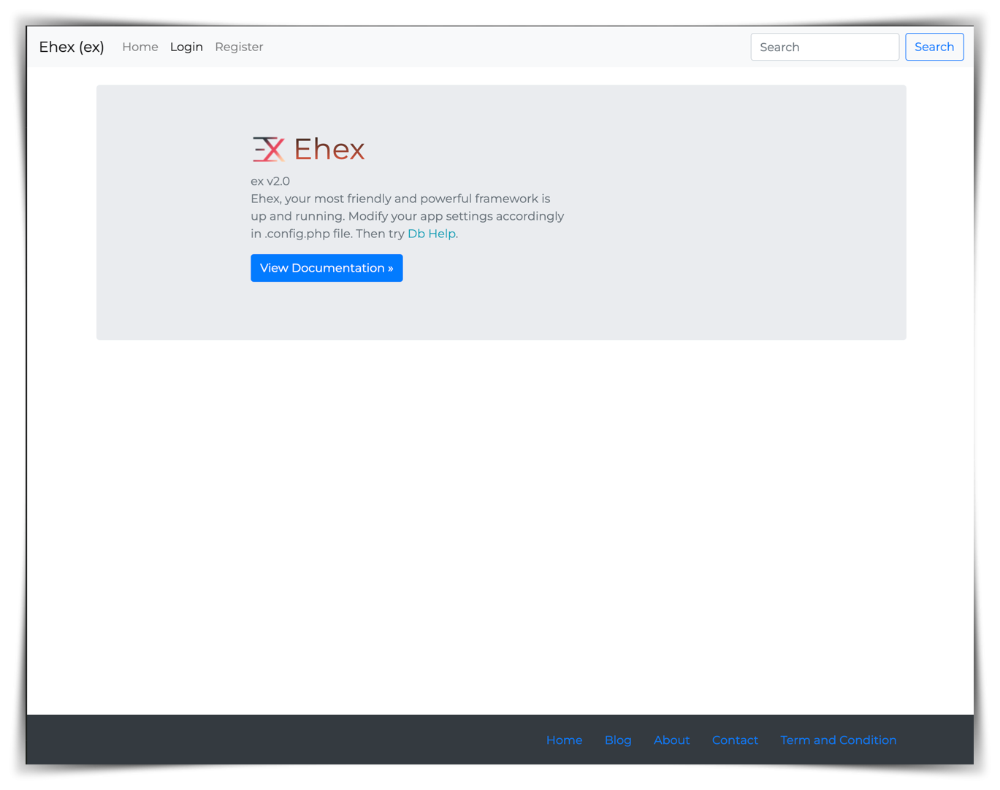
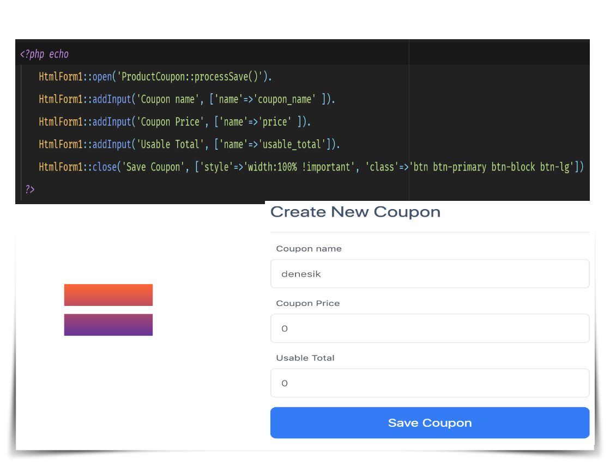
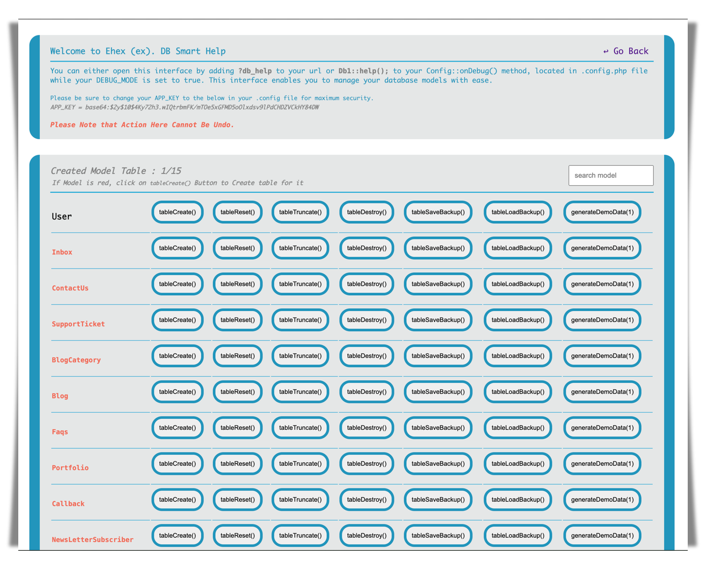

## Creating a form
In Ehex, creating a form could be as easy as.



# Ehex PHP Framework
Flexible and Friendly Php Framework, Created with many features.

## Documentation
> Read Full Documentation now  [Documentation](https://ehexphp.github.io/ehex-docs/#/)  and Check out  [Api Documentation](https://ehexphp.github.io/ehex-docs-api/ ':include :type=iframe width=100% height=800px')

## Installation
> See Quick Start [Starting a new Project](https://ehexphp.github.io/ehex-docs/#/Starting%20a%20new%20Project)

## Install packages
```shell
  composer install
```

## Start application
```shell
composer run-script start
```
OR `php -S localhost:8081`


## Install new Plugin
1. Add the plugin to require section (in your composer.json):
   e.g `"usmanhalalit/strana": "1.*@dev"`
   them run `composer update`

2. Or `composer require usmanhalalit/strana`

## Auto Database management
To manage your database, setup database connection in your .env and
append ?db_help to your URL e.g [http://localhost:8081?db_help](http://localhost:8081?db_help)



## Ehex.
is an Application Development Framework - a toolkit - for people who build web sites using PHP. Its goal is to enable you to develop projects much faster than you could if you were writing code from scratch, by providing a rich set of libraries for commonly needed tasks, as well as a simple interface and logical structure to access these libraries. EX lets you creatively focus on your project by minimizing the amount of code needed for a given task.
More so, Ehex has similar functions and features with [_Laravel_](https://laravel.com),
i.e, your experience with Laravel Blade and Eloquent Query Builder are still useful here,
and that is one of the intention for the similarity.

## "Out of box" Features
Not only does this Framework solve problems like repetition of common codes to make Web development easier, but it also provides a lot of ready made complete features and tools Like :

* Auto Database Table Creation (from Php Class extending Model1, Table Reset, Delete, Truncate, or Filled with Demo Data e.t.c )
* Html Quick Form Creator (with HtmlForm1 class )
* Blade layout (similar to laravel),
* Eloquent Query
* Common Page and Backend code for Index page, Authentication(login, register, logout and delete account), Dashboard page e.t.c
* Util Class for different problems including String, Math, Array e.t.c

## SIMPLE
Designed to be simple and powerful, no complicated artisan command or any command. Just Calls Designed functions. Ex. enables you to design a complete and professional website under few minute.

## EXTENSIBLE
Add powerful plugins or tweak the built-in codes to fit your needs.

## Server Requirements
PHP version 7.3 or newer is recommended.
We would have love to make it work on lower version as well, but we strongly advise you NOT to run such old versions of PHP, because of potential security and performance issues, as well as missing features.

## Why Ehex?
1. Simple and lightweight framework. [< 5mb core code]
1. Simple and Understandable Folder Structure.
1. Create/Debug very fast
1. Easy to migrate from Laravel.
1. Almost Everything is automatic
1. Automatic generation of Database and Model Table
    -  Auto Generate and Create Model Database Table.
1. Automatic generation of Html Form (default bootstrap class)
    - Auto Generate Html Form, Html Widget, e.t.c.
1. Using Composer, Themes and Plugins (like CMS).
1. Inbuilt Admin Dashboard.
1. Inbuilt Html Widget
    - access with HtmlWidget1::
1. Advance and Standard CRUD Operation.
1. CRUD Database Table Management
1. Laravel Blade and Laravel Eloquent Query Builder
1. Ehex Query Builder
1. Inbuilt Authentication
1. Inbuilt Status Popup
1. Smart HtmlForm Library Auto-Generator
1. Simple Folder Structure and Easy to Navigate
1. Direct Controller Call in Form Action. (using ehex CLF)
1. Direct Api Call in Ajax. (using ehex CLF)
1. Many and Advance and Clean util functions
1. Auto Loader of Controllers, Models, and Api
1. Layout Theme Assets (like CMS)
1. Multiple Site Can Share the same Library(Hence, makes a portable code)
1. And More...

## License
> Please see the license agreement. [License](https://github.com/ehexphp/ehex-framework/blob/master/LICENSE)

## Resources
- [User Guide](/) - Available
- [Language File Translations](/) - Available
- [Community Forums](/) - Not Available Yet
- [Community Wiki](/) - Not Available Yet
- [Community Slack Channel](/) - Not Available Yet
- Report security issues to our Security Panel or via our page on [HackerOne](https://hackerone.com/ehex), thank you.

## Acknowledgement
The Ehex creator ([Samson Oyetola](https://github.com/samtax01)) would like to thank all the Ehex contributors and you, the Ehex user.

## Donating
Help keeping the project development going, by contributing or donating a little. Thanks in advance.
[buy a cup of coffee](https://www.patreon.com/samtax01). :heart: